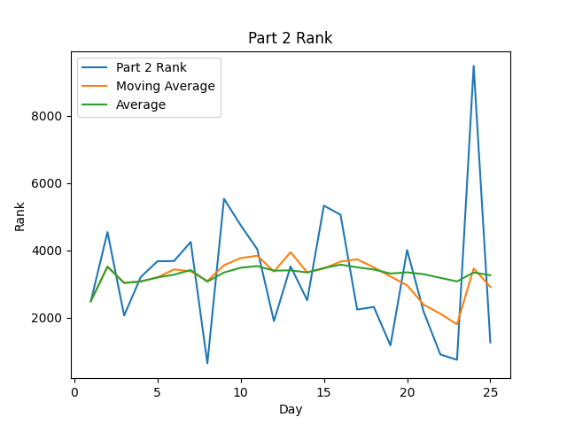
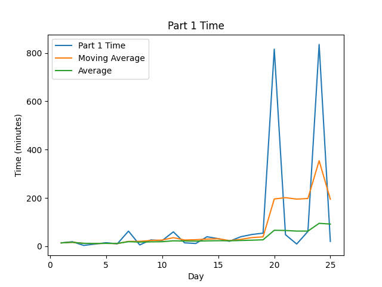

# AoC-2019
[Advent of Code](https://adventofcode.com) Solutions for 2020 in TypeScript.
This year, I have self-imposed a rule that I will be unit testing every day's submission, and, unless I am completely
unable to do so, have every solution able to solve both parts in under a second on my 2017 MacBook Pro (15") (I failed
at this requirement on Day 17...).

## Highlights:

#### Favorite problems:

* 

#### Interesting approaches:

* 

#### Leaderboard appearances:

* Didn't get on the leaderboard proper, but I did manage to get 303rd on day 3-1,
  so I was pretty excited about that!
* I got two triple digit showings on the 8th day!

## Stats
| Day | Part 1 Time (Rank) (Score) | Part 2 Time (Rank) (Score) |
|----:|----------------------------|----------------------------|
|   1 | 00:14:05 ( 2536) (  0)     | 00:17:41 ( 2486) (  0)     |
|   2 | 00:18:49 ( 4170) (  0)     | 00:30:15 ( 4542) (  0)     |
|   3 | 00:03:39 (  303) (  0)     | 00:15:04 ( 2060) (  0)     |
|   4 | 00:09:02 ( 1154) (  0)     | 00:49:01 ( 3205) (  0)     |
|   5 | 00:14:47 ( 2420) (  0)     | 00:29:02 ( 3673) (  0)     |
|   6 | 00:09:56 ( 3666) (  0)     | 00:20:03 ( 3681) (  0)     |
|   7 | 01:02:42 ( 5573) (  0)     | 01:15:43 ( 4248) (  0)     |
|   8 | 00:05:42 (  629) (  0)     | 00:13:18 (  636) (  0)     |
|   9 | 00:26:22 ( 6287) (  0)     | 00:39:45 ( 5533) (  0)     |
|  10 | 00:23:30 ( 6342) (  0)     | 01:30:53 ( 4746) (  0)     |
|  11 | 00:59:44 ( 5118) (  0)     | 01:20:17 ( 4030) (  0)     |
|  12 | 00:14:16 ( 1665) (  0)     | 00:33:18 ( 1892) (  0)     |
|  13 | 00:11:28 ( 2227) (  0)     | 02:14:02 ( 3522) (  0)     |
|  14 | 00:39:28 ( 3708) (  0)     | 01:02:48 ( 2514) (  0)     |
|  15 | 00:31:30 ( 3604) (  0)     | 01:27:36 ( 5329) (  0)     |
|  16 | 00:20:39 ( 2106) (  0)     | 02:34:58 ( 5057) (  0)     |
|  17 | 00:39:17 ( 1636) (  0)     | 01:02:40 ( 2238) (  0)     |
|  18 | 00:48:43 ( 2650) (  0)     | 01:12:31 ( 2315) (  0)     |
| Avg | 00:25:12 ( 3099) (  0)     | 00:59:23 ( 3428) (  0)     |

<!--suppress CheckImageSize -->
 
 

Note: Times are from time of challenge release, not start time to completion time

## Scripting initially based on a script from [Ullaakut](https://github.com/Ullaakut/aoc19). Expanded upon by [HBiede](https://github.com/hbiede)
#### Makefile Automation
* Automatically downloads the challenge and input for the day (e.g.: `make download DAY=03`)
  * In order to use this target, you need to specify your session cookie from [adventofcode.com](https://adventofcode.com) in cookies.txt through the usage of `make cookie SESSION={Insert your session cookie here}`.
  * Parses the challenge into a markdown file (adds Markdown style headers and code blocks).
* Setup the new day's source file from a template file while downloading the input and challenge per above (e.g.: `make DAY=03`)
* Create the stats table above by calling `make stats`
  * May require calling `pip3 install -r requirements.txt` to ensure you have all the necessary python dependencies
