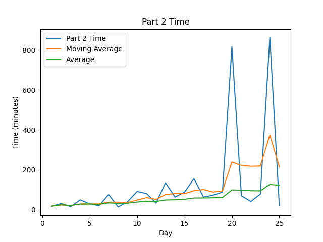

# AoC-2019
[Advent of Code](https://adventofcode.com) Solutions for 2020 in TypeScript.
This year, I have self-imposed a rule that I will unit test every day's submission, and, unless I am completely unable
to do so, have every solution able to solve both parts in under a second on my 2017 MacBook Pro (15") 

## Highlights:

#### Favorite problems:

* 

#### Interesting approaches:

* 

#### Leaderboard appearances:

* Didn't get on the leaderboard proper, but I did manage to get 303rd on day 3-1,
  so I was pretty excited about that!

## Stats
STATS_TABLE

 
 

Note: Times are from time of challenge release, not start time to completion time

## Scripting initially based on a script from [Ullaakut](https://github.com/Ullaakut/aoc19). Expanded upon by [HBiede](https://github.com/hbiede)
#### Makefile Automation
* Automatically downloads the challenge and input for the day (e.g.: `make download DAY=03`)
  * In order to use this target, you need to specify your session cookie from [adventofcode.com](https://adventofcode.com) in cookies.txt through the usage of `make cookie SESSION={Insert your session cookie here}`.
  * Parses the challenge into a markdown file (adds Markdown style headers and code blocks).
* Setup the new day's source file from a template file while downloading the input and challenge per above (e.g.: `make DAY=03`)
* Create the stats table above by calling `make stats`
  * May require calling `pip3 install -r requirements.txt` to ensure you have all the necessary python dependencies
