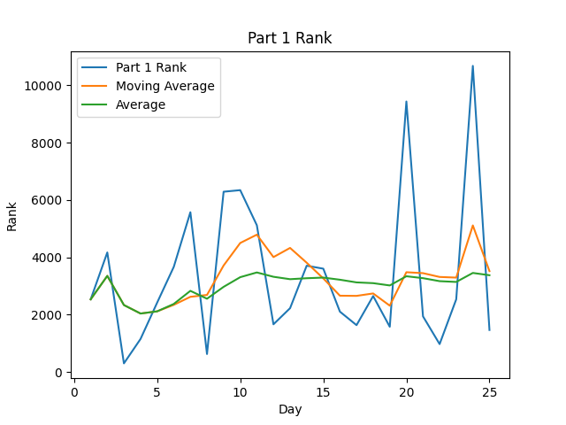

# AoC-2019
[Advent of Code](adventofcode.com) Solutions for 2019 in (LANGUAGE).

## Highlights:

#### Favorite problems:

* 
* 
* 

#### Interesting approaches:

* 

#### Leaderboard appearances:

* 

## Stats
STATS_TABLE

 
 

Note: Times are from time of challenge release, not my start time to completion time

## Scripting initially based on a script from [Ullaakut](https://github.com/Ullaakut/aoc19). Expanded upon by [HBiede](https://github.com/Ullaakut/hbiede)
#### Makefile Automation
* Automatically downloads the challenge and input for the day (e.g.: `make download DAY=03`)
  * In order to use this target, you need to specify your session cookie from adventofcode.com in cookies.txt through the usage of `make cookie SESSION={Insert your session cookie here}`.
  * Parses the challenge into a markdown file (adds Markdown style headers and code blocks).
  * Per Ullaakut, this part still needs a bit of work, as multiline code blocks are not supported yet, and formatting (bold, italics etc.) is lost.
* Setup the new day's source file from a template file while downloading the input and challenge per above (e.g.: `make DAY=03`)
* Create the stats table above by calling `make stats`
  * May require calling `sh scripts/install_stats_dependencies.sh` to ensure you have all the necessary python dependencies
